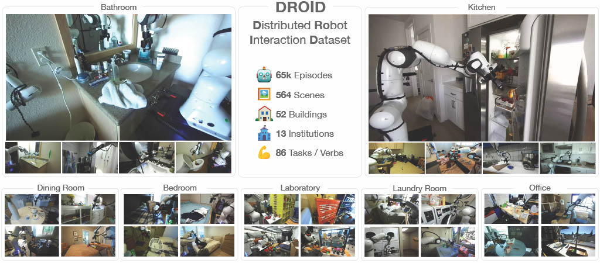

# 🤖 **D**istributed **RO**bot **I**nteraction **D**ataset

## 👋 Welcome to the DROID Developer Documentation

This goal of this documentation site is to enable robotics researchers to:

1. Replicate the hardware of the DROID data collection platform.
2. Configure software to make the DROID data collection platform operational.
3. Onboard developers/users on using the platform and contributing data to the DROID.

The guides for accomplishing these goals are split into the following high-level sections:

* 🔨 [**Hardware Setup:**](https://alexanderkhazatsky.github.io/R2D2/docs/hardware-setup) a list of the required hardware (with links to suppliers) and a guide for assembling the platform.
* 🖥️ [**Software Setup:**](https://alexanderkhazatsky.github.io/R2D2/docs/software-setup) guides on configuring device settings and software. 
* 📈 [**The DROID Dataset:**](https://alexanderkhazatsky.github.io/R2D2/docs/the-droid-dataset) an in-the-wild robot manipulation dataset.
* 🤖 [**Example Workflows:**](https://alexanderkhazatsky.github.io/R2D2/docs/example-workflows) tutorials for common workflows (e.g. data collection, policy deployment).
* 📖 [**Contribution Guidelines:**](https://alexanderkhazatsky.github.io/R2D2/docs/contribution-guidelines) guidelines for contributing data to DROID. 

